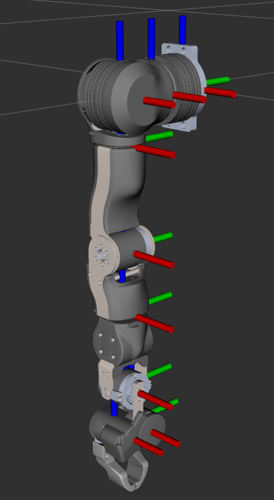
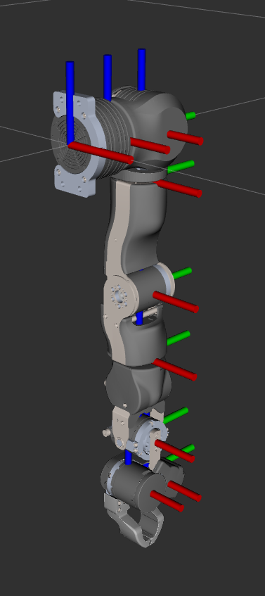
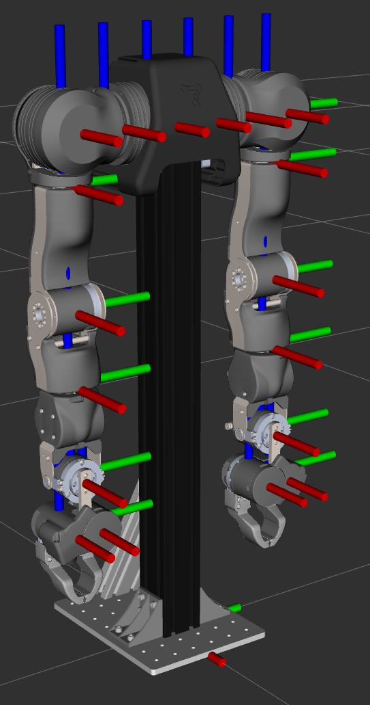
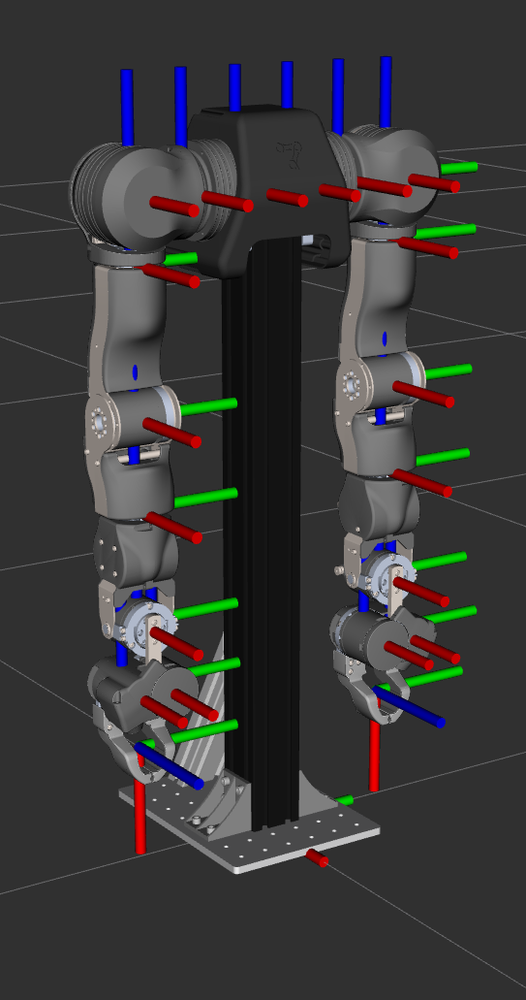

# OpenArm v2.0 Description

## 1. Quick Start

### 1.1 Build and Source the Workspace

The current xacro files still use `$(find openarm_description)` for package path
resolution, so the ROS 2 workspace must be built at least once.

```bash
cd ~/ros2_ws
source /opt/ros/${ROS_DISTRO}/setup.bash
colcon build --packages-select openarm_description
source install/setup.bash
```

After changing xacro files, launch files, RViz configs, meshes, or packaged
configuration resources, rebuild and source the workspace again before relying
on ROS 2 launch or installed package paths.

### 1.2 Generate the Default Dual-Arm URDF

```bash
cd ~/ros2_ws/src/openarm_description
bash scripts/generate_v20_urdfs.sh
```

The default run generates:

- `urdf/openarm_default_bimanual.urdf`
- `urdf/openarm_default_bimanual_grasp.urdf`

### 1.3 Preview in RViz

```bash
ros2 launch openarm_description display_openarm.launch.py
```

Preview a single right arm with a pinch gripper:

```bash
ros2 launch openarm_description display_openarm.launch.py \
  robot_preset:=right_arm_with_pinch_gripper \
  rviz_config:=arm_only.rviz
```

Preview a model with grasp helper frames:

```bash
ros2 launch openarm_description display_openarm.launch.py \
  robot_preset:=default_bimanual \
  emit_grasp_frame:=true
```

### 1.4 Preview in VS Code with the URDF Visualizer Extension

Install the [URDF Visualizer extension](https://marketplace.visualstudio.com/items?itemName=morningfrog.urdf-visualizer).
If meshes do not resolve automatically, add a package mapping for
`openarm_description` in `.vscode/settings.json`.

## 2. Preset Preview

These images show representative outputs from the current presets. They are small
previews only; use RViz or a URDF viewer for detailed inspection.

| Right arm with pinch gripper | Left arm with pinch gripper |
| --- | --- |
|  |  |

| Default bimanual | Bimanual with grasp frame |
| --- | --- |
|  |  |

## 3. Assets Layout

```text
assets/
|-- robot/
|   `-- openarm_v2.0/
|       |-- config/
|       |-- imgs/
|       |-- meshes/
|       `-- urdf/
|-- end_effector/
|   `-- pinch_gripper/
|       |-- config/
|       |-- meshes/
|       `-- urdf/
`-- sensor/
    `-- zed/
        `-- urdf_wrapper/
```

Main responsibilities:

| Path | Purpose |
| --- | --- |
| `assets/robot/openarm_v2.0/config/` | Robot presets plus OpenArm body and arm YAML configs |
| `assets/robot/openarm_v2.0/meshes/` | OpenArm body and arm visual / collision meshes |
| `assets/robot/openarm_v2.0/imgs/` | Documentation preview images |
| `assets/robot/openarm_v2.0/urdf/` | The public v2.0 xacro entry point and assembly utilities |
| `assets/end_effector/<product>/` | Reusable end-effector configs, meshes, and optional standalone xacro |
| `assets/sensor/<product>/` | Sensor wrappers or local sensor assets |

The preset schema still uses semantic types such as `robot`, `end_effector`,
and `sensor`. Those types map to the matching directories under `assets/`.
For example, `type: sensor` and `product: zed` resolves to:

```text
assets/sensor/zed/
```

This keeps all mesh, image, config, and wrapper resources in one package asset
root while preserving clear product labels such as `openarm_v2.0`.

## 4. Core Entry Point

The public entry point is:

```text
assets/robot/openarm_v2.0/urdf/openarm_v20.urdf.xacro
```

It exposes three arguments:

| Argument | Default | Meaning |
| --- | --- | --- |
| `robot_preset` | `default_bimanual` | Selects `config/robot_presets/<name>.yaml` |
| `collapse_internal_empty_links` | `true` | Collapses internal empty links between the arm and EE when possible |
| `emit_grasp_frame` | `false` | Emits grasp helper frames for supported end effectors |

Direct xacro example:

```bash
xacro assets/robot/openarm_v2.0/urdf/openarm_v20.urdf.xacro \
  robot_preset:=right_arm_with_pinch_gripper \
  emit_grasp_frame:=true \
  > urdf/openarm_right_arm_with_pinch_gripper_grasp.urdf
```

For day-to-day use, prefer the wrapper script:

```bash
bash scripts/generate_v20_urdfs.sh --preset right_arm_with_pinch_gripper --grasp-frame
```

## 5. What a Preset Is

`config/robot_presets/*.yaml` files describe robot assembly variants. They do
not store mesh or inertia values directly. Instead, they tell xacro:

- What the root frame is called.
- Which components are enabled.
- Whether each component comes from `robot`, `end_effector`, or `sensor`.
- Which product and config payload each component should use.
- Which inertial config each component should use.
- What link and joint name prefix to apply to each component.
- Which parent component each child component attaches to.
- Which reference point should be used for alignment.
- Whether a component should be mirrored.
- Whether any joint limits should be overridden.

A preset usually starts like this:

```yaml
robot:
  root_frame: world
  components:
    - body
    - primary_arm
    - secondary_arm
    - primary_arm_end_effector
    - secondary_arm_end_effector
```

`robot.components` defines the component scan order. xacro starts from the
single enabled root component and recursively emits attached children.

## 6. Preset Field Reference

| Field | Applies to | Meaning |
| --- | --- | --- |
| `type` | all | Top-level component source. Currently supported: `robot`, `end_effector`, `sensor` |
| `enabled` | all | Whether the component participates in this URDF generation |
| `product` | all | Product directory under `assets/<type>/`, for example `openarm_v2.0`, `pinch_gripper`, or `zed` |
| `config` | all | String for an internal config/member, `null` when the product has no extra index, or an object passed to a wrapper |
| `inertials` | robot / end_effector | Selects `inertials/<name>.yaml`; currently `nominal` is the common value |
| `prefix` | robot / end_effector / sensor | Prefix for emitted link and joint names, for example `openarm_left_` |
| `link_name` | robot body | Renames the emitted body link; body currently has one link |
| `connection.attach_to` | child component | Selects the parent component |
| `connection.parent_reference_point` | child component | Uses a reference point on the parent component as the mount point |
| `connection.parent` | all | Explicit parent link override; overrides the link inferred from a reference point |
| `connection.origin` | all | Explicit mount origin override; can override fields inferred from a reference point |
| `reflect.x/y/z` | all | Mirror axes; only one axis may currently be set to `-1` |
| `reflect.include` | all | Limits mirroring to specific links, joints, and reference points |
| `limit_override_joints` | arm / end_effector | Overrides selected joint limits |

Each component chooses its own inertial file through `inertials`. For example,
`inertials: nominal` loads `inertials/nominal.yaml` from that component's config
package. If you add another file such as `inertials/cad_refresh.yaml`, you can
switch only the desired component in the preset:

```yaml
primary_arm:
  type: robot
  product: openarm_v2.0
  config: arm
  inertials: cad_refresh
```

`config` is interpreted by its shape:

| Shape | Meaning |
| --- | --- |
| string | Load an internal config/member, for example `body` or `arm` |
| `null` | Use the product root config directly |
| object | Pass wrapper parameters through, for example ZED camera arguments |

## 7. Asset Config Structure

### 7.1 Arm Config

```text
config/arm/
|-- struct/
|   |-- topology.yaml
|   |-- name_mapping.yaml
|   `-- reference_points.yaml
|-- joint/
|   |-- joint_origins.yaml
|   |-- joint_axes.yaml
|   |-- joint_limits.yaml
|   `-- joint_mimics.yaml
|-- link/
|   |-- visuals.yaml
|   `-- collisions.yaml
|-- inertials/
|   `-- nominal.yaml
`-- control/
    |-- control_gains.yaml
    `-- friction.yaml
```

The xacro assembly primarily reads:

- `struct/topology.yaml`: link and joint tree structure.
- `struct/reference_points.yaml`: assembly reference points such as
  `ee_mount_point`.
- `joint/joint_origins.yaml`: joint origins.
- `joint/joint_axes.yaml`: joint axes.
- `joint/joint_limits.yaml`: joint limits.
- `link/visuals.yaml`: visual mesh, scale, and origin data.
- `link/collisions.yaml`: collision mesh, scale, and origin data.
- `inertials/nominal.yaml`: mass, inertia, and inertial origin data.

The parameters under `control/` are currently not part of the main URDF assembly
path. They are reserved for control-side or later integration work.

### 7.2 Body Config

The body is currently a single-link component. Its main files are:

- `struct/topology.yaml`
- `struct/reference_points.yaml`
- `link/visuals.yaml`
- `link/collisions.yaml`
- `inertials/nominal.yaml`

Body reference points are used to mount the left and right arms, for example:

- `left_arm_mount_point`
- `right_arm_mount_point`

### 7.3 End-Effector Config

For `pinch_gripper`, the structure is:

```text
assets/end_effector/pinch_gripper/config/
|-- struct/
|   |-- topology.yaml
|   |-- name_mapping.yaml
|   `-- reference_points.yaml
|-- joint/
|   |-- joint_origins.yaml
|   |-- joint_axes.yaml
|   |-- joint_limits.yaml
|   `-- joint_mimics.yaml
|-- link/
|   |-- visuals.yaml
|   `-- collisions.yaml
`-- inertials/
    `-- nominal.yaml
```

The `grasp_frame` entry in `reference_points.yaml` is emitted as a helper link
when `emit_grasp_frame:=true`.

### 7.4 Sensor Products

Sensors can be attached through thin OpenArm wrappers around external description
packages. The first planned product is `zed`, which uses the `zed_description`
package from `zed-ros2-description`.

Sensor components are not currently enabled in the standard robot presets.

<!-- The wrapper is:

```text
assets/sensor/zed/urdf_wrapper/openarm_zed_wrapper.xacro
```

It includes:

```text
$(find zed_description)/urdf/zed_macro.urdf.xacro
```

and calls `xacro:zed_camera`. OpenArm only adds the fixed mount joint from the
chosen parent link or reference point to `${sensor_name}_camera_link`.

Example:

```yaml
head_zed:
  type: sensor
  enabled: true
  product: zed
  config:
    camera_name: openarm_head_zed
    camera_model: zed2i
    custom_baseline: 0.0
    enable_gnss: false
  prefix: openarm_head_
  connection:
    attach_to: body
    parent_reference_point: zed_front_mount_point
    parent: null
    origin: null
  reflect:
    x: 1
    y: 1
    z: 1
```

The example preset `example_default_bimanual_with_zed.yaml` shows a body-mounted
ZED camera. Its `zed_front_mount_point` pose is intentionally easy to tune from
CAD or calibration. -->


## 8. Empty-Link Collapse

`collapse_internal_empty_links` defaults to `true`. It handles internal empty
links around the arm-to-EE connection. These helper frames are typically created
so independent component development can define the arm-side joint frame and
mount pose before the arm and EE are fully assembled together.

When all of the following conditions are true, xacro collapses the parent
component's terminal empty link:

- The parent component supports tip collapse; currently this applies to arm
  components.
- The parent's terminal link has no inertial, visual, or collision data.
- The child component attaches to that terminal link through
  `parent_reference_point`.
- The child component does not explicitly set `connection.parent`.
- No multiple children compete for the same terminal empty link.

Here, "terminal link" means the final canonical link in the parent component's
`topology.links` list, for example `link7` in the arm config. It does not mean
the original source-URDF child helper link that was converted into a
`reference_points.yaml` entry during extraction.

After collapse, the child component base frame absorbs the original mount
transform, and the generated URDF is simpler.

To keep these internal empty links, generate a no-collapse variant:

```bash
bash scripts/generate_v20_urdfs.sh --keep-empty-links
```

Or call xacro directly:

```bash
xacro assets/robot/openarm_v2.0/urdf/openarm_v20.urdf.xacro \
  robot_preset:=default_bimanual \
  collapse_internal_empty_links:=false \
  > urdf/openarm_default_bimanual_no_collapse.urdf
```

## 9. Grasp Frame

`emit_grasp_frame` defaults to `false`. When enabled, supported end effectors
read `grasp_frame` from their own `reference_points.yaml` and emit it as a fixed
helper link. This `grasp_frame` is the nominal reference pose for grasping an
object with the gripper.

```bash
bash scripts/generate_v20_urdfs.sh --preset right_arm_with_pinch_gripper --grasp-frame
```

Notes:

- If a preset does not enable an end effector, `--grasp-frame` will not add an
  actual grasp frame.
- If the end-effector config does not define a `grasp_frame` reference point, no
  helper frame is emitted.
- The current `pinch_gripper` supports `grasp_frame`.

<!-- ## 10. Pinch Gripper

The current `openarm_v20_ee.xacro` primarily targets a two-finger gripper topology:

```text
base_link
|-- joint1 -> link1
`-- joint2 -> link2
```

It also handles:

- `ee_` link name prefixing.
- finger link emission.
- finger joint emission.
- mimic joint remapping.
- mirrored joint origins, axes, and limits.
- optional `grasp_frame`.

The left-side gripper usually needs:

```yaml
reflect:
  x: 1
  y: -1
  z: 1
```

The right-side gripper usually uses:

```yaml
reflect:
  x: 1
  y: 1
  z: 1
``` -->

## 10. Common Generation Commands

Generate the default dual-arm model:

```bash
bash scripts/generate_v20_urdfs.sh
```

Generate all presets:

```bash
bash scripts/generate_v20_urdfs.sh --all
```

Generate one preset:

```bash
bash scripts/generate_v20_urdfs.sh --preset right_arm_with_pinch_gripper
```

Generate the grasp-frame variant for one preset:

```bash
bash scripts/generate_v20_urdfs.sh \
  --preset right_arm_with_pinch_gripper \
  --grasp-frame
```

Generate no-collapse variants:

```bash
bash scripts/generate_v20_urdfs.sh --keep-empty-links
```

Generate all presets as no-collapse grasp-frame variants:

```bash
bash scripts/generate_v20_urdfs.sh --all --keep-empty-links --grasp-frame
```

The output directory is:

```text
urdf/
```

## 11. Current Limitations

- Mirroring currently supports only one reflected axis.
- `openarm_v20_ee.xacro` currently focuses on the two-finger pinch gripper.
- `collapse_internal_empty_links` is designed for the arm terminal empty-link to
  EE base connection case.
- `control/` parameters are not yet part of the main URDF assembly path.

<!-- Recommended Maintenance Rules

- Add robot variants by adding presets first; avoid copying the whole xacro tree.
- Modify YAML first when changing geometry, inertia, joint, or reference-point
  parameters.
- Modify `urdf/utils/*.xacro` only when assembly rules need to change.
- Add a new end effector as an independent `assets/end_effector/<product>/config`
  and mesh package.
- After modifying source URDF, refresh configs through the extraction scripts
  and compare test output before release.
- After changing presets, generate at least default bimanual, left arm, right
  arm, left arm with gripper, and right arm with gripper variants. -->

## 12. Future Work

- Extract a more general component emitter, especially for the shared body and arm
  emission paths, so new component classes can be supported with less duplicated
  xacro logic.
- Support more complex mirroring and reference-frame transformations.
- Generalize end-effector definitions beyond the current two-finger pinch
  gripper-specific emitter.

<!--
Potential later split:

- `docs/openarm_v2.0/README.md`: quick start, core concepts, common commands.
- `docs/openarm_v2.0/architecture.md`: xacro assembly algorithm, preset validation,
  mirroring, and collapse.
- `docs/openarm_v2.0/preset_schema.md`: preset field reference and examples.
- `docs/openarm_v2.0/extraction.md`: source URDF to YAML extraction workflow.
- `docs/openarm_v2.0/troubleshooting.md`: common errors and debugging.
-->
